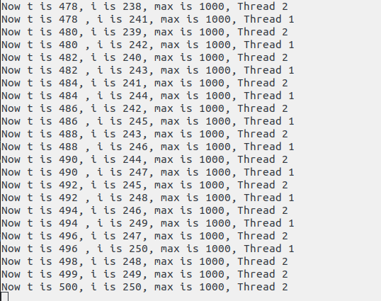

# C&C++用法
## 多线程

语法：

pthread_create()    创建一个线程

```c
int pthread_create(pthread_t *tid, const pthread_attr_t *attr, void *method, void *args);
```

pthread_exit()  销毁一个线程

```c
pthread_exit(void *retval);

```


pthread_join()  主线程等待tid线程结束

```c
pthread_join(pthread_t tid, void **retval);

```

pthread_detach()    主线程和子线程分离，子线程结束后，资源自动回收

```c
pthread_detach(pthread_t tid, void **retval);

```

pthread_mutex_init()    初始化一个互斥锁

pthread_mutex_lock()    获取互斥锁

pthread_mutex_unlock()  放弃互斥锁

pthread_mutex_trylock() 尝试获取锁。如果获取锁，则返回0，否则返回EBUSY。

pthread_mutex_destroy() 销毁锁(用完需要销毁锁)


样例：

+ 代码

    ```c
    #include <pthread.h>
    #include <stdio.h>
    #include <unistd.h>


    int max = 1000;
    int t = 0;

    void *increase1(void *args){
        int i = 1;
        while (i <= max/4)
        {
            printf("Now t is %3d , i is %3d, max is %3d, Thread 1\n", t, i, max);
            ++t;
            i++;
            sleep(0.1);
        }
        
    }

    void *increase2(void *args){

        int i = 1;
        while (i <= max/4)
        {
            ++t;
            printf("Now t is %3d, i is %3d, max is %3d, Thread 2\n", t, i, max);
        
            sleep(0.1);
            ++i;
        }
        
    }

    int main(){

        pthread_t tid1;
        pthread_t tid2;
        pthread_create(&tid1, NULL, increase1, NULL);
        pthread_create(&tid2, NULL, increase2, NULL);
        getchar();
        return 1;
    }

    ```
+ 结果

    

+ 原因：
        
    出现线程安全问题，需要添加锁。

+ 改进：

    ```c
    #include <pthread.h>
    #include <stdio.h>
    #include <unistd.h>


    int max = 1000;
    int t = 0;

    pthread_mutex_t mut;

    void *increase1(void *args){
        int i = 1;
        while (i <= max/4)
        {
            pthread_mutex_lock(&mut);
            ++t;
            pthread_mutex_unlock(&mut);
            printf("Now t is %.3d , i is %.3d, max is %.3d, Thread 1\n", t, i, max);
            i++;
            sleep(0.1);
        }
        
    }

    void *increase2(void *args){

        int i = 1;
        while (i <= max/4)
        {
            pthread_mutex_lock(&mut);
            ++t;
            pthread_mutex_unlock(&mut);
            printf("Now t is %3d, i is %.3d, max is %.3d, Thread 2\n", t, i, max);
            ++i;
            sleep(0.1);
            
        }
        
    }

    int main(){

        pthread_t tid1;
        pthread_t tid2;
        pthread_mutex_init(&mut, NULL);
        pthread_create(&tid1, NULL, increase1, NULL);
        pthread_create(&tid2, NULL, increase2, NULL);
        getchar();
        pthread_mutex_destroy(&mut);
        return 1;
    }


    ```
    
