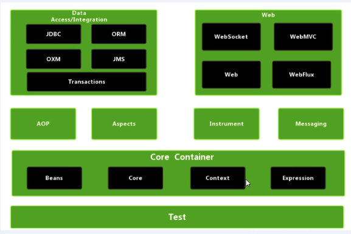

# Spring5框架
## 主要内容
1. Spring 框架概述
2. IOC 容器
3. AOP
4. Jdbc Template
5. 事务管理
6. Spring5新特性
## Spring框架概述
1. Spring 是轻量级的开源的JavaEE框架
2. Spring 可以解决企业应用开发的负责型
3. Spring 的两个基本的功能：IOC 和AOP
    IOC:控制反转，把创建的对西哪个过程交给Spring进行管理
    AOP:面向切面，步修改源代码进行功能增强
4. Spring 特点
   1. 方便解耦，简化开发（Spring可以对对象进行管理）
   2. AOP编程支持
   3. 方便编程测试
   4. 方便和其他的框架结合
   5. 方便对事务操作
   6. 降低API开发难度
## Spring的入门案例
### 创建步骤
1. 下载spring框架[下载链接](https://repo.spring.io/release/org/springframework/spring/)
2. 创建一个Java项目
3. 导入相应的包
   1. Beans
   2. Core
   3. Context
   4. Expression
   5. Logging
4. 添加依赖
5. 创建一个类
6. 增加一个xml的配置文件，配置bean
7. 创建一个测试类，通过IOC方式，创建一个对象，调用方法。

### spring framework的包结构

## IOC(Inversion of Control) 容器
1. IOC 底层原理
2. IOC 接口(BeanFactory)
3. IOC 操作Bean管理(基于XML)
4. IOC 操作Bean管理(基于注释)
### IOC 底层原理
+ 第一种(原始的方法)：
    实现：直接创建对象产生引用。
    缺点：耦合度太高
+ 第二种(工厂模式)：
    实现：通过工厂创建对象，使用的时候，调用工厂类来间接获取。
    缺点：耦合度有所降低
+ 第三种(IOC):
    实现：xml配置文件，配置创建的对象；创建工厂类,工厂类中通过解析xml文件，获取类的全限定名 ，通过反射创建对象。
### IOC接口
1. IOC思想是基于IOC容器完成，IOC容器底层就是对象工厂。
2. Spring提供IOC容器实现两种方式(两个接口)：
   1. BeanFactory:IOC容器的底层，框架内置的接口，不提倡开发人员使用；加载xml的时候，不会主动加载相应的类，会等到使用的时候才会加载。
   2. ApplicationContext:BeanFactory接口的子接口，提供更强大的功能，供开发人员使用，在加载解析xml文件的时候，就会主动加载相应的类。
