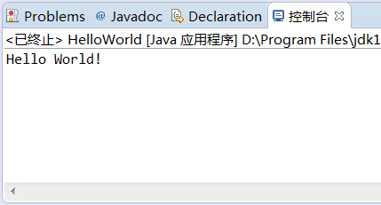

# 使用markdown语法

## 标题部分

语法的部分

    #       一级标题
    ##      二级标题
    ###     三级标题
    ####    四级标题
    #####   五级标题

样例：

#       一级标题
##      二级标题
###     三级标题
####    四级标题
#####   五级标题

## 列表部分

语法：

    有序序号
        1. 有序序号1
        2. 有序序号2
        3. 有序序号3
        4. 有序序号4
    无序序号
        + 无序列表案例1
        - 无序列表案例2
        * 无序列表案例3
样例：

有序序号
1. 有序序号1
2. 有序序号2
3. 有序序号3

无序序号
+ 无序列表案例1
- 无序列表案例2
* 无序列表案例3

## 字符块（字符块内的md语法有些会失效）

语法：
    代码块
        ```java(可以选择填写相应的语言，不指定采用默认)
            相关代码
        ```
    引用
        tab 相关字符
    带标志的引用
        > 相关字符(>可以嵌套使用)
        
样例：
+ 代码块
```Java
    public class HelloWorld {
        public static void main(String[] args){
            System.out.println("Hello World!");
    }
}
```
+ 引用
    相关字符
+ 带标志的引用
> 相关字符
>> 相关字符(嵌套两层使用)
## 链接

语法：

+ 图片链接


+ 样例：



    网络链接
        [链接文字](点击文字跳转的地址，可以是锚点)
        注：
            [跳转到锚点](#a)
            [跳转到百度](www.baidu.com)
[跳转到锚点](#a)
## 表格
用|表示表格纵向边界，表头和表内容用-隔开，并可用:进行对齐设置，两边都有:则表示居中，若不加:则默认左对齐。
|表头1额外若无若而我无而|表头2werwrwrwerrw|
|:---:|:---:|
|数据|数据|
## 跳转

## 字体
*斜体*
**加粗**
~~删除线~~
---
_下划线_
```html
    <font face="华文新魏" color="red" size = 60 id = "a">这是数据</font>
    <table><tr><td bgcolor = "red" size = 60>denghuo </td></tr></table>
```

`nihao `
## 简答的html语法
### 字体

- [x]  
- [ ] 

~your text~