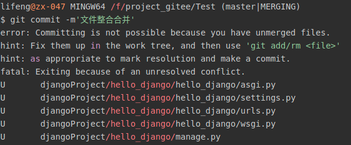
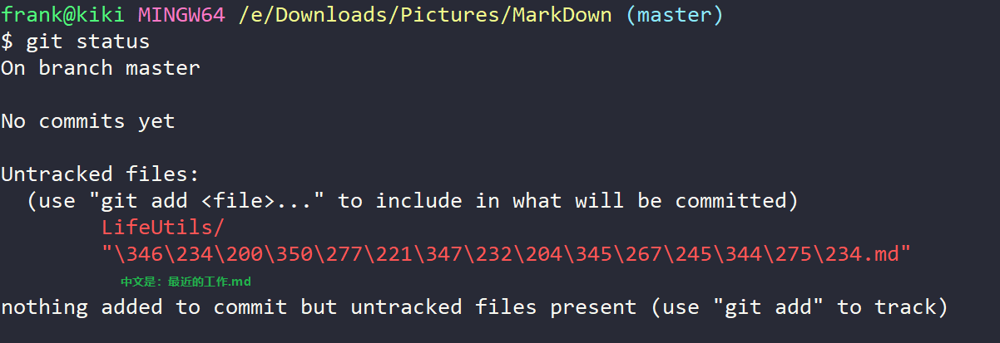

# Git使用过程中出现的问题
[toc]
## git pull origin master，远程仓库和本地仓库版本不一致
问题：

    fatal：refusing to merge unrelated histories

解决方法：

    git pull origin master --allow-unrelated-history
## git 上无法显示中文
问题：

解决方法：

    git config --global core.quotepath false
