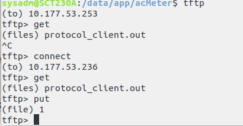

# Linux常见的快捷键

[toc]

## tftp

+ 用法1
    语法：

        tftp
        connect
        ip  输入连接的ip
        get/push    输入发起的动作
        filename    输入相关文件的名字

    样例：

    
+ 用法2
    语法：

        tftp -g -l B.txt -r A.txt ip 从ip获取A.txt,存储为B.txt
        tftp -p -r B.txt -l A.txt ip 上传至ip，A.txt更名为B.txt
        tftp -gr A.txt ip
        tftp -pl A.txt ip
    
