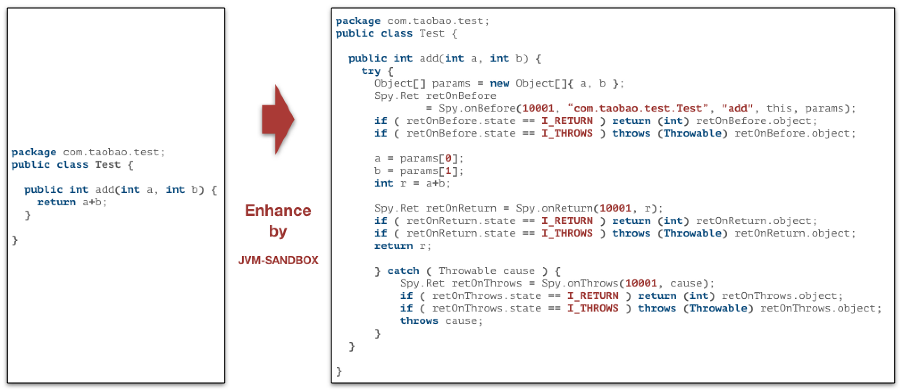
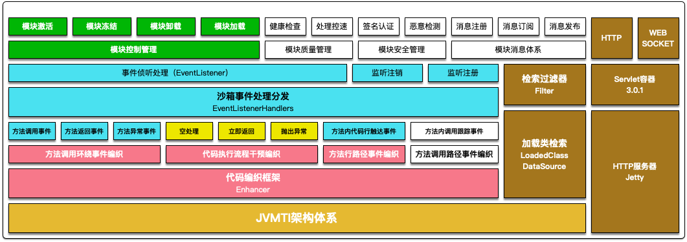

# sandbox设计理念

**JVM-SANDBOX（沙箱）实现了一种在不重启、不侵入目标JVM应用的AOP解决方案。**

## 设计初衷

1. 第一种方案：SpringAOP的方式来完成相对业务代码透明的AOP织入方式。

```txt

1. 不是所有业务代码都托管在Spring容器中
2. 更底层的中间件代码、三方包代码无法纳入到回归范围。
3. 测试框架会引入自身所依赖的类库，经常与业务代码的类库产生冲突。
```

2. 第二种方案：在更底层的JVMTI来完成这套AOP逻辑的实现，破坏了双亲委派原则来实现类的隔离策略。
```txt
1. 在这一层实现AOP，尤其是attach的启动模式，对现有的AOP字节码编织方案都做了限制，JDKProxy、CgLib等常见的AOP实现框架都无法满足需求，所以我们用ASM构造了一套精巧的字节码编织策略。
```

## 功能需求

1. 在JVM-Sandbox的世界观中，任何一个Java方法的调用都可以分解为BEFORE、RETURN和THROWS三个环节，由此在三个环节上引申出对应环节的事件探测和流程控制机制。不仅如此还有LINE事件，可以完成代码行的记录。基于BEFORE、RETURN和THROWS三个环节事件以及LINE事件，可以完成很多类AOP的操作。

```txt
1. 感知和改变方法调用的入参
2. 可以感知和改变方法调用返回值和抛出的异常
3. 可以感知一个请求按顺序执行了哪些行
4. 可以改变方法执行的流程等。
```

## 项目简介


### 沙箱的特性

1. `无侵入`：目标应用无需重启也无需感知沙箱的存在
1. `类隔离`：沙箱以及沙箱的模块不会和目标应用的类相互干扰
1. `可插拔`：沙箱以及沙箱的模块可以随时加载和卸载，不会在目标应用留下痕迹
1. `多租户`：目标应用可以同时挂载不同租户下的沙箱并独立控制
1. `高兼容`：支持JDK[6,11]

### 沙箱常见应用场景

- 线上故障定位
- 线上系统流控
- 线上故障模拟
- 方法请求录制和结果回放
- 动态日志打印
- 安全信息监测和脱敏

*JVM-SANDBOX还能帮助你做很多很多，取决于你的脑洞有多大了。*

### 实时无侵入AOP框架

在常见的AOP框架实现方案中，有静态编织和动态编织两种。

1. **静态编织**：静态编织发生在字节码生成时根据一定框架的规则提前将AOP字节码插入到目标类和方法中，实现AOP；
2. **动态编织**：动态编织则允许在JVM运行过程中完成指定方法的AOP字节码增强.常见的动态编织方案大多采用重命名原有方法，再新建一个同签名的方法来做代理的工作模式来完成AOP的功能(常见的实现方案如CgLib)，但这种方式存在一些应用边界：
   - **侵入性**：对被代理的目标类需要进行侵入式改造。比如：在Spring中必须是托管于Spring容器中的Bean
   - **固化性**：目标代理方法在启动之后即固化，无法重新对一个已有方法进行AOP增强
 
要解决`无侵入`的特性需要AOP框架具备 **在运行时完成目标方法的增强和替换**。在JDK的规范中运行期重定义一个类必须准循以下原则
  1. 不允许新增、修改和删除成员变量
  1. 不允许新增和删除方法
  1. 不允许修改方法签名

JVM-SANDBOX属于基于Instrumentation的动态编织类的AOP框架，**通过精心构造了字节码增强逻辑，使得沙箱的模块能在不违反JDK约束情况下实现对目标应用方法的`无侵入`运行时AOP拦截**。

## 核心原理

### 事件驱动

在沙箱的世界观中，任何一个Java方法的调用都可以分解为`BEFORE`、`RETURN`和`THROWS`三个环节，由此在三个环节上引申出对应环节的事件探测和流程控制机制。

```java
// BEFORE
try {

   /*
    * do something...
    */

    // RETURN
    return;

} catch (Throwable cause) {
    // THROWS
}
```

基于`BEFORE`、`RETURN`和`THROWS`三个环节事件分离，沙箱的模块可以完成很多类AOP的操作。

1. 可以感知和改变方法调用的入参
1. 可以感知和改变方法调用返回值和抛出的异常
1. 可以改变方法执行的流程
    - 在方法体执行之前直接返回自定义结果对象，原有方法代码将不会被执行
    - 在方法体返回之前重新构造新的结果对象，甚至可以改变为抛出异常
    - 在方法体抛出异常之后重新抛出新的异常，甚至可以改变为正常返回

### 类隔离策略

沙箱通过自定义的SandboxClassLoader破坏了双亲委派的约定，实现了和目标应用的类隔离。所以不用担心加载沙箱会引起应用的类污染、冲突。各模块之间类通过ModuleJarClassLoader实现了各自的独立，达到模块之间、模块和沙箱之间、模块和应用之间互不干扰。


### 类增强策略

沙箱通过在BootstrapClassLoader中埋藏的Spy类完成目标类和沙箱内核的通讯



### 整体架构



## 运行

1. 通过脚本安装的方式监听对应的进程

```shell
./sandbox.sh -p 33342
```

2. 通过agent方式进行挂在

```shell
java test.class -javaagent:/opt/sandbox/lib/sandbox-agent.jar

注： javaagent方式可以确保sandbox代码在应用代码加载之前完成载入，避免引起目标JVM full GC。
```

## 事件介绍

BEFORE事件：执行方法体之前被调用
RETURN事件：执行方法体返回之前调用
THROWS事件：执行方法体抛出一场之前调用

LINE事件：方法被执行后调用，目前仅记录行号

CALL_BEFORE事件：一个方法被调用之前。
CALL_RETURN事件：一个方法被调用正常返回之后。
CALL_THROWS事件：一个方法被调用抛出异常之后。

## 生命周期

模块生命周期类型有模块加载、模块卸载、模块激活、模块冻结、模块加载完成五个状态。

+ 模块加载：创建ClassLoader，完成模块的加载
+ 模块卸载：模块增强的类会重新load，去掉增强的字节码
+ 模块激活：模块被激活后，模块所增强的类将会被激活，所有com.alibaba.jvm.sandbox.api.listener.EventListener将开始收到对应的事件
+ 模块冻结：模块被冻结后，模块所持有的所有com.alibaba.jvm.sandbox.api.listener.EventListener将被静默，无法收到对应的事件。需要注意的是，模块冻结后虽然不再收到相关事件，但沙箱给对应类织入的增强代码仍然还在。
+ 模块加载完成：模块加载已经完成，这个状态是为了做日志处理，本身不会影响模块变更行为

模块可以通过实现com.alibaba.jvm.sandbox.api.ModuleLifecycle接口，对模块生命周期进行控制，接口中的方法：

+ onLoad：模块开始加载之前调用
+ onUnload：模块开始卸载之前调用
+ onActive：模块被激活之前调用，抛出异常将会是阻止模块被激活的唯一方式
+ onFrozen：模块被冻结之前调用，抛出异常将会是阻止模块被冻结的唯一方式