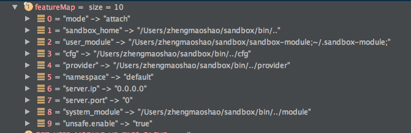

# sandbox 代码逻辑

# 启动
1. 通过脚本启动sandbox-core.jar (参数包括：Target_JVM_PID, sandbox-agent.jar, token)

2. sandbox-core指定启动类：在pom文件中指定mainClass
```xml
<plugin>
    <groupId>org.apache.maven.plugins</groupId>
    <artifactId>maven-assembly-plugin</artifactId>
    <executions>
        <execution>
            <goals>
                <goal>attached</goal>
            </goals>
            <phase>package</phase>
            <configuration>
                <descriptorRefs>
                    <descriptorRef>jar-with-dependencies</descriptorRef>
                </descriptorRefs>
                <archive>
                    <manifest>
                        <mainClass>com.alibaba.jvm.sandbox.core.CoreLauncher</mainClass>
                    </manifest>
                </archive>
            </configuration>
        </execution>
    </executions>
</plugin>
```
3. 通过attach的方式与目标VM建立通信
```java
    // attach到目标应用，加载agent
    com.alibaba.jvm.sandbox.core.CoreLauncher#attachAgent

    private void attachAgent(final String targetJvmPid,
                             final String agentJarPath,
                             final String cfg) throws Exception {

        VirtualMachine vmObj = null;
        try {

            vmObj = VirtualMachine.attach(targetJvmPid);
            if (vmObj != null) {
                vmObj.loadAgent(agentJarPath, cfg);
            }

        } finally {
            if (null != vmObj) {
                vmObj.detach();
            }
        }

    }
```


4. sandbox-agent的pom文件配置Premain-Class和Agent-Class两个参数，并且都指向AgentLauncher这个类
```xml
<plugin>
    <groupId>org.apache.maven.plugins</groupId>
    <artifactId>maven-assembly-plugin</artifactId>
    <executions>
        <execution>
            <goals>
                <goal>attached</goal>
            </goals>
            <phase>package</phase>
            <configuration>
                <descriptorRefs>
                    <descriptorRef>jar-with-dependencies</descriptorRef>
                </descriptorRefs>
                <archive>
                    <manifestEntries>
                        <Premain-Class>com.alibaba.jvm.sandbox.agent.AgentLauncher</Premain-Class>
                        <Agent-Class>com.alibaba.jvm.sandbox.agent.AgentLauncher</Agent-Class>
                        <Can-Redefine-Classes>true</Can-Redefine-Classes>
                        <Can-Retransform-Classes>true</Can-Retransform-Classes>
                    </manifestEntries>
                </archive>
            </configuration>
        </execution>
    </executions>
</plugin>
```

5. AgentLauncher通过writeAttachResult()为每个租户实现一个token文件（namespace,token,ip,port）和install(featureMap, inst)。

```java
// attach 模式，调用install方法，同时生成token文件(namespace, token, host, port)
public static void agentmain(String featureString, Instrumentation inst) {
        LAUNCH_MODE = LAUNCH_MODE_ATTACH;
        final Map<String, String> featureMap = toFeatureMap(featureString);
        writeAttachResult(
                getNamespace(featureMap),
                getToken(featureMap),
                install(featureMap, inst)
        );
    }

// agent 模式，调用install方法
public static void premain(String featureString, Instrumentation inst) {
    LAUNCH_MODE = LAUNCH_MODE_AGENT;
    install(toFeatureMap(featureString), inst);
}

```
> 重点方法：com.alibaba.jvm.sandbox.agent.AgentLauncher#install(featureMap, inst)

```java
    // com.alibaba.jvm.sandbox.agent.AgentLauncher#install

    private static synchronized InetSocketAddress install(final Map<String, String> featureMap,
                                                          final Instrumentation inst) {

        final String namespace = getNamespace(featureMap);
        final String propertiesFilePath = getPropertiesFilePath(featureMap);
        final String coreFeatureString = toFeatureString(featureMap);

        try {
            final String home = getSandboxHome(featureMap);
            // 将Spy注入到BootstrapClassLoader
            inst.appendToBootstrapClassLoaderSearch(new JarFile(new File(
                    getSandboxSpyJarPath(home)
                    // SANDBOX_SPY_JAR_PATH
            )));

            // 构造自定义的类加载器，尽量减少Sandbox对现有工程的侵蚀
            final ClassLoader sandboxClassLoader = loadOrDefineClassLoader(
                    namespace,
                    getSandboxCoreJarPath(home)
                    // SANDBOX_CORE_JAR_PATH
            );

            // CoreConfigure类定义
            final Class<?> classOfConfigure = sandboxClassLoader.loadClass(CLASS_OF_CORE_CONFIGURE);

            // 反序列化成CoreConfigure类实例
            final Object objectOfCoreConfigure = classOfConfigure.getMethod("toConfigure", String.class, String.class)
                    .invoke(null, coreFeatureString, propertiesFilePath);

            // CoreServer类定义
            final Class<?> classOfProxyServer = sandboxClassLoader.loadClass(CLASS_OF_PROXY_CORE_SERVER);

            // 获取CoreServer单例
            final Object objectOfProxyServer = classOfProxyServer
                    .getMethod("getInstance")
                    .invoke(null);

            // CoreServer.isBind()
            final boolean isBind = (Boolean) classOfProxyServer.getMethod("isBind").invoke(objectOfProxyServer);


            // 如果未绑定,则需要绑定一个地址
            if (!isBind) {
                try {
                    classOfProxyServer
                            .getMethod("bind", classOfConfigure, Instrumentation.class)
                            .invoke(objectOfProxyServer, objectOfCoreConfigure, inst);
                } catch (Throwable t) {
                    classOfProxyServer.getMethod("destroy").invoke(objectOfProxyServer);
                    throw t;
                }

            }

            // 返回服务器绑定的地址
            return (InetSocketAddress) classOfProxyServer
                    .getMethod("getLocal")
                    .invoke(objectOfProxyServer);


        } catch (Throwable cause) {
            throw new RuntimeException("sandbox attach failed.", cause);
        }

    }
```

+ 启动类加载器加载sandbox-spy.jar
SANDBOX_SPY_JAR_PATH=/Users/zhengmaoshao/sandbox/bin/../lib/sandbox-spy.jar

+ 构造自定义的类加载器，实现代码隔离
SANDBOX_CORE_JAR_PATH=/Users/zhengmaoshao/sandbox/bin/../lib/sandbox-core.jar

```java
// 自定义的类加载器

com.alibaba.jvm.sandbox.agent.SandboxClassLoader
// 自定义namespace，实现类隔离。
SandboxClassLoader(final String namespace,
                    final String sandboxCoreJarFilePath) throws MalformedURLException {
    super(new URL[]{new URL("file:" + sandboxCoreJarFilePath)});
    this.path = sandboxCoreJarFilePath;
    this.toString = String.format("SandboxClassLoader[namespace=%s;path=%s;]", namespace, path);
}

//打破双亲委派机制，通过自定义的ClassLoader加载。
protected synchronized Class<?> loadClass(String name, boolean resolve) throws ClassNotFoundException {
    final Class<?> loadedClass = findLoadedClass(name);
    if (loadedClass != null) {
        return loadedClass;
    }

//        // 优先从parent（SystemClassLoader）里加载系统类，避免抛出ClassNotFoundException
//        if(name != null && (name.startsWith("sun.") || name.startsWith("java."))) {
//            return super.loadClass(name, resolve);
//        }

    try {
        Class<?> aClass = findClass(name);
        if (resolve) {
            resolveClass(aClass);
        }
        return aClass;
    } catch (Exception e) {
        return super.loadClass(name, resolve);
    }
}

```

+ 实例化sandbox-core.jar中的CoreConfigure内核启动配置类
CoreConfigure内核启动配置类内容： 



+ 获取sandbox-core.jar中的ProxyCoreServer对象实例，注意这里真正被实例化的其实JettyCoreServer

+ 调用JettyCoreServer bind方法开始进入启动httpServer流程

a. 初始化logback日志框架

b. 创建一个沙箱对象，JvmSandbox构造方法中的关键步骤：

```java
public JvmSandbox(final CoreConfigure cfg,
                    final Instrumentation inst) {
    //获取事件处理类实例
    EventListenerHandler.getSingleton();
    this.cfg = cfg;
    // 初始化模块管理实例
    this.coreModuleManager = SandboxProtector.instance.protectProxy(CoreModuleManager.class, new DefaultCoreModuleManager(
            cfg,
            inst,
            new DefaultCoreLoadedClassDataSource(inst, cfg.isEnableUnsafe()),
            new DefaultProviderManager(cfg)
    ));

    init();
}

```
> 初始化模块管理实例

- 这里面通过new DefaultProviderManager(cfg)对默认服务提供管理器实现进行实例化。
主要是创建了一个针对服务提供库sandbox-mgr-provider.jar的ClassLoader，sandbox-mgr-provider中的类通过JAVA SPI的方式实现可扩展性

- 初始化模块目录，包括/Users/zhengmaoshao/sandbox/bin/../module文件夹中系统模块和/Users/zhengmaoshao/.sandbox-module文件夹中的用户自定义模块

- 初始化Spy类
```java
// com.alibaba.jvm.sandbox.core.util.SpyUtils#init

public synchronized static void init(final String namespace) {

    if (!Spy.isInit(namespace)) {
        Spy.init(namespace, EventListenerHandler.getSingleton());
    }

}
```
c. 初始化Jetty's ContextHandler，启动httpServer

```java

public synchronized void bind(final CoreConfigure cfg, final Instrumentation inst) throws IOException {
        this.cfg = cfg;
        try {
            initializer.initProcess(new Initializer.Processor() {
                @Override
                public void process() throws Throwable {
                    LogbackUtils.init(
                            cfg.getNamespace(),
                            cfg.getCfgLibPath() + File.separator + "sandbox-logback.xml"
                    );
                    logger.info("initializing server. cfg={}", cfg);
                    jvmSandbox = new JvmSandbox(cfg, inst);
                    initHttpServer();
                    initJettyContextHandler();
                    httpServer.start();
                }
            });

            // 初始化加载所有的模块
            try {
                jvmSandbox.getCoreModuleManager().reset();
            } catch (Throwable cause) {
                logger.warn("reset occur error when initializing.", cause);
            }

            final InetSocketAddress local = getLocal();
            logger.info("initialized server. actual bind to {}:{}",
                    local.getHostName(),
                    local.getPort()
            );

        } catch (Throwable cause) {

            // 这里会抛出到目标应用层，所以在这里留下错误信息
            logger.warn("initialize server failed.", cause);

            // 对外抛出到目标应用中
            throw new IOException("server bind failed.", cause);
        }

        logger.info("{} bind success.", this);
    }

```
## 模块管理


sandbox启动后，最后一步操作进入默认的模块管理类reset()方法。


```java
com.alibaba.jvm.sandbox.core.manager.impl.DefaultCoreModuleManager#reset

public synchronized CoreModuleManager reset() throws ModuleException {

    logger.info("resetting all loaded modules:{}", loadedModuleBOMap.keySet());

    // 1. 强制卸载所有模块
    unloadAll();

    // 2. 加载所有模块
    
    for (final File moduleLibDir : moduleLibDirArray) {
        // 用户模块加载目录，加载用户模块目录下的所有模块
        // 对模块访问权限进行校验
        if (moduleLibDir.exists() && moduleLibDir.canRead()) {
            new ModuleLibLoader(moduleLibDir, cfg.getLaunchMode())
                    .load(
                            new InnerModuleJarLoadCallback(),
                            new InnerModuleLoadCallback()
                    );
        } else {
            logger.warn("module-lib not access, ignore flush load this lib. path={}", moduleLibDir);
        }
    }

    return this;
}
```
### 加载

加载模块包括两个部分：
- 路径/Users/zhengmaoshao/sandbox/bin/../module 下的系统模块sandbox-mgr-module.jar
- 路径/Users/zhengmaoshao/.sandbox-module 下的用户自定义模块

```java
com.alibaba.jvm.sandbox.core.manager.impl.ModuleLibLoader#load

/**
    * 加载Module
    *
    * @param mjCb 模块文件加载回调
    * @param mCb  模块加载回掉
    */
void load(final ModuleJarLoadCallback mjCb,
            final ModuleJarLoader.ModuleLoadCallback mCb) {

    // 开始逐条加载
    for (final File moduleJarFile : listModuleJarFileInLib()) {
        try {
            mjCb.onLoad(moduleJarFile);
            new ModuleJarLoader(moduleJarFile, mode).load(mCb);
        } catch (Throwable cause) {
            logger.warn("loading module-jar occur error! module-jar={};", moduleJarFile, cause);
        }
    }

}
```
1. 模块文件加载回调

```java
void load(final ModuleJarLoadCallback mjCb,
            final ModuleJarLoader.ModuleLoadCallback mCb) {

    // 开始逐条加载
    for (final File moduleJarFile : listModuleJarFileInLib()) {
        try {
            mjCb.onLoad(moduleJarFile);
            new ModuleJarLoader(moduleJarFile, mode).load(mCb);
        } catch (Throwable cause) {
            logger.warn("loading module-jar occur error! module-jar={};", moduleJarFile, cause);
        }
    }

}
```

2. 模块加载回调
- 创建模块类加载器
- 将当前线程的类加载器从沙箱类加载器设置成模块类加载器
- 加载模块
- 将当前线程的类加载器从模块类加载器设置成沙箱类加载器
```java
com.alibaba.jvm.sandbox.core.manager.impl.ModuleJarLoader#ModuleJarLoader

ModuleJarLoader(final File moduleJarFile,
                final Information.Mode mode) {
    this.moduleJarFile = moduleJarFile;
    this.mode = mode;
}

com.alibaba.jvm.sandbox.core.manager.impl.ModuleJarLoader#load

void load(final ModuleLoadCallback mCb) throws IOException {

    boolean hasModuleLoadedSuccessFlag = false;
    ModuleJarClassLoader moduleJarClassLoader = null;
    logger.info("prepare loading module-jar={};", moduleJarFile);
    try {
        moduleJarClassLoader = new ModuleJarClassLoader(moduleJarFile);

        final ClassLoader preTCL = Thread.currentThread().getContextClassLoader();
        Thread.currentThread().setContextClassLoader(moduleJarClassLoader);

        try {
            hasModuleLoadedSuccessFlag = loadingModules(moduleJarClassLoader, mCb);
        } finally {
            Thread.currentThread().setContextClassLoader(preTCL);
        }

    } finally {
        if (!hasModuleLoadedSuccessFlag
                && null != moduleJarClassLoader) {
            logger.warn("loading module-jar completed, but NONE module loaded, will be close ModuleJarClassLoader. module-jar={};", moduleJarFile);
            moduleJarClassLoader.closeIfPossible();
        }
    }

}
com.alibaba.jvm.sandbox.core.manager.impl.ModuleJarLoader#loadingModules

private boolean loadingModules(final ModuleJarClassLoader moduleClassLoader,
                                final ModuleLoadCallback mCb) {

    final Set<String> loadedModuleUniqueIds = new LinkedHashSet<String>();
    final ServiceLoader<Module> moduleServiceLoader = ServiceLoader.load(Module.class, moduleClassLoader);
    final Iterator<Module> moduleIt = moduleServiceLoader.iterator();
    while (moduleIt.hasNext()) {

        final Module module;
        try {
            module = moduleIt.next();
        } catch (Throwable cause) {
            logger.warn("loading module instance failed: instance occur error, will be ignored. module-jar={}", moduleJarFile, cause);
            continue;
        }

        final Class<?> classOfModule = module.getClass();

        // 判断模块是否实现了@Information标记
        if (!classOfModule.isAnnotationPresent(Information.class)) {
            logger.warn("loading module instance failed: not implements @Information, will be ignored. class={};module-jar={};",
                    classOfModule,
                    moduleJarFile
            );
            continue;
        }

        final Information info = classOfModule.getAnnotation(Information.class);
        final String uniqueId = info.id();

        // 判断模块ID是否合法
        if (StringUtils.isBlank(uniqueId)) {
            logger.warn("loading module instance failed: @Information.id is missing, will be ignored. class={};module-jar={};",
                    classOfModule,
                    moduleJarFile
            );
            continue;
        }

        // 判断模块要求的启动模式和容器的启动模式是否匹配
        if (!ArrayUtils.contains(info.mode(), mode)) {
            logger.warn("loading module instance failed: launch-mode is not match module required, will be ignored. module={};launch-mode={};required-mode={};class={};module-jar={};",
                    uniqueId,
                    mode,
                    StringUtils.join(info.mode(), ","),
                    classOfModule,
                    moduleJarFile
            );
            continue;
        }

        try {
            if (null != mCb) {
                mCb.onLoad(uniqueId, classOfModule, module, moduleJarFile, moduleClassLoader);
            }
        } catch (Throwable cause) {
            logger.warn("loading module instance failed: MODULE-LOADER-PROVIDER denied, will be ignored. module={};class={};module-jar={};",
                    uniqueId,
                    classOfModule,
                    moduleJarFile,
                    cause
            );
            continue;
        }

        loadedModuleUniqueIds.add(uniqueId);

    }


    logger.info("loaded module-jar completed, loaded {} module in module-jar={}, modules={}",
            loadedModuleUniqueIds.size(),
            moduleJarFile,
            loadedModuleUniqueIds
    );
    return !loadedModuleUniqueIds.isEmpty();
}


com.alibaba.jvm.sandbox.core.manager.impl.DefaultCoreModuleManager#load
/**
    * 加载并注册模块
    * <p>1. 如果模块已经存在则返回已经加载过的模块</p>
    * <p>2. 如果模块不存在，则进行常规加载</p>
    * <p>3. 如果模块初始化失败，则抛出异常</p>
    *
    * @param uniqueId          模块ID
    * @param module            模块对象
    * @param moduleJarFile     模块所在JAR文件
    * @param moduleClassLoader 负责加载模块的ClassLoader
    * @throws ModuleException 加载模块失败
    */
private synchronized void load(final String uniqueId,
                                final Module module,
                                final File moduleJarFile,
                                final ModuleJarClassLoader moduleClassLoader) throws ModuleException {

    if (loadedModuleBOMap.containsKey(uniqueId)) {
        logger.debug("module already loaded. module={};", uniqueId);
        return;
    }

    logger.info("loading module, module={};class={};module-jar={};",
            uniqueId,
            module.getClass().getName(),
            moduleJarFile
    );

    // 初始化模块信息
    final CoreModule coreModule = new CoreModule(uniqueId, moduleJarFile, moduleClassLoader, module);

    // 注入@Resource资源
    injectResourceOnLoadIfNecessary(coreModule);

    callAndFireModuleLifeCycle(coreModule, MODULE_LOAD);

    // 设置为已经加载
    coreModule.markLoaded(true);

    // 如果模块标记了加载时自动激活，则需要在加载完成之后激活模块
    markActiveOnLoadIfNecessary(coreModule);

    // 注册到模块列表中
    loadedModuleBOMap.put(uniqueId, coreModule);

    // 通知生命周期，模块加载完成
    callAndFireModuleLifeCycle(coreModule, MODULE_LOAD_COMPLETED);

}
com.alibaba.jvm.sandbox.core.manager.impl.DefaultCoreModuleManager#injectResourceOnLoadIfNecessary


private void injectResourceOnLoadIfNecessary(final CoreModule coreModule) throws ModuleException {
    try {
        final Module module = coreModule.getModule();
        for (final Field resourceField : FieldUtils.getFieldsWithAnnotation(module.getClass(), Resource.class)) {
            final Class<?> fieldType = resourceField.getType();

            // LoadedClassDataSource对象注入
            if (LoadedClassDataSource.class.isAssignableFrom(fieldType)) {
                writeField(
                        resourceField,
                        module,
                        classDataSource,
                        true
                );
            }

            // ModuleEventWatcher对象注入
            else if (ModuleEventWatcher.class.isAssignableFrom(fieldType)) {
                final ModuleEventWatcher moduleEventWatcher = coreModule.append(
                        new ReleaseResource<ModuleEventWatcher>(
                                SandboxProtector.instance.protectProxy(
                                        ModuleEventWatcher.class,
                                        new DefaultModuleEventWatcher(inst, classDataSource, coreModule, cfg.isEnableUnsafe(), cfg.getNamespace())
                                )
                        ) {
                            @Override
                            public void release() {
                                logger.info("release all SandboxClassFileTransformer for module={}", coreModule.getUniqueId());
                                final ModuleEventWatcher moduleEventWatcher = get();
                                if (null != moduleEventWatcher) {
                                    for (final SandboxClassFileTransformer sandboxClassFileTransformer
                                            : new ArrayList<SandboxClassFileTransformer>(coreModule.getSandboxClassFileTransformers())) {
                                        moduleEventWatcher.delete(sandboxClassFileTransformer.getWatchId());
                                    }
                                }
                            }
                        });

                writeField(
                        resourceField,
                        module,
                        moduleEventWatcher,
                        true
                );
            }

            // ModuleController对象注入
            else if (ModuleController.class.isAssignableFrom(fieldType)) {
                writeField(
                        resourceField,
                        module,
                        new DefaultModuleController(coreModule, this),
                        true
                );
            }

            // ModuleManager对象注入
            else if (ModuleManager.class.isAssignableFrom(fieldType)) {
                writeField(
                        resourceField,
                        module,
                        new DefaultModuleManager(this),
                        true
                );
            }

            // ConfigInfo注入
            else if (ConfigInfo.class.isAssignableFrom(fieldType)) {
                writeField(
                        resourceField,
                        module,
                        new DefaultConfigInfo(cfg),
                        true
                );
            }

            // EventMonitor注入
            else if (EventMonitor.class.isAssignableFrom(fieldType)) {
                writeField(
                        resourceField,
                        module,
                        new EventMonitor() {
                            @Override
                            public EventPoolInfo getEventPoolInfo() {
                                return new EventPoolInfo() {
                                    @Override
                                    public int getNumActive() {
                                        return 0;
                                    }

                                    @Override
                                    public int getNumActive(Event.Type type) {
                                        return 0;
                                    }

                                    @Override
                                    public int getNumIdle() {
                                        return 0;
                                    }

                                    @Override
                                    public int getNumIdle(Event.Type type) {
                                        return 0;
                                    }
                                };
                            }
                        },
                        true
                );
            }

            // 其他情况需要输出日志警告
            else {
                logger.warn("module inject @Resource ignored: field not found. module={};class={};type={};field={};",
                        coreModule.getUniqueId(),
                        coreModule.getModule().getClass().getName(),
                        fieldType.getName(),
                        resourceField.getName()
                );
            }

        }
    } catch (IllegalAccessException cause) {
        throw new ModuleException(coreModule.getUniqueId(), MODULE_LOAD_ERROR, cause);
    }
}


```

ModuleJarLoader的loadingModules方法中的关键步骤：

1.通过ServiceLoader加载工具，从sandbox-mgr-module.jar加载沙箱环境模块接口Module的实现类。
实际就是加载ControlModule，InfoModule，ModuleMgrModule 这三个用于内部操作的类。

调用模块加载回调onLoad方法，进入到真正进行模块加载的DefaultCoreModuleManager load方法。

DefaultCoreModuleManager load方法关键步骤：

1.实例化模块业务对象，注入@resource资源，包括我们自定义Module中的@Resource资源都是在这个时候注入的，在ControlModule中即是沙箱配置信息ConfigInfo

2.设置生命周期

3.因为注解@Information中isActiveOnLoad表示是否在加载时候就激活模块，它的默认值是true, 所以会进入激活模块逻辑，这里需要注意，如果不希望启动时候就激活模块，则设置为false。模块只有在激活之后才能增强目标类。

在启动过程中系统模块和自定义模块到加载过程就分析完了，ControlModule，InfoModule，ModuleMgrModule 这三个系统模块提供了一些通过shell命令可以操作的方法。


### 刷新

### 卸载

## 增强目标类

