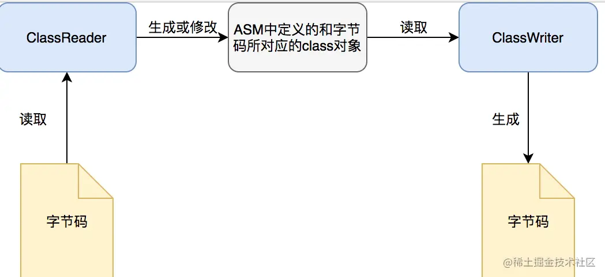
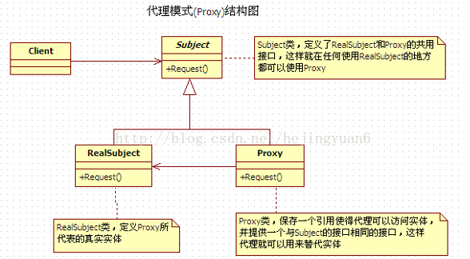

# 常见问题

## 字节码增强
[参考链接](https://tech.meituan.com/2019/09/05/java-bytecode-enhancement.html)

### ASM
[参考链接](https://juejin.cn/post/6844903641841680397?spm=a2c6h.12873639.article-detail.6.32706ab23Stgmi)
ASM是一个java字节码操纵框架，它能被用来动态生成类或者增强既有类的功能。ASM 可以直接产生二进制 class 文件，也可以在类被加载入 Java 虚拟机之前动态改变类行为。Java class 被存储在严格格式定义的 .class文件里，这些类文件拥有足够的元数据来解析类中的所有元素：类名称、方法、属性以及 Java 字节码（指令）。ASM从类文件中读入信息后，能够改变类行为，分析类信息，甚至能够根据用户要求生成新类。
ASM的优点如下:

1. 动态生成类或者增强既有类的功能
2. 字节码转换成java语言，从而你就可以随心所欲的操纵字节码。
3. 可以直接产生二进制 class 文件，也可以在类被加载入 Java 虚拟机之前动态改变类行为
4. ASM从类文件中读入信息后，能够改变类行为，分析类信息，甚至能够根据用户要求生成新类。


### ASM库

ASM 库提供了两个用于生成和转换已编译类的API。

1. 一个是核心API，以基于事件的形式来表示类。
```txt
核心api，可以对比XML中解析的SAX，不需要把这个类的整个结构读取进来，节约内存，但是编程难度较大。在采用基于事件的模型时，类是用一系列事件来表示的，每个事件表示类的一个元素，比如它的一个字段、一个方法声明、一条指令，等等。基于事件的API定义了一组可能事件，以及这些事件必须遵循的发生顺序，还􁨀供了一个类分析器，为每个被分析元素生成一个事件，还􁨀供一个类写入器，由这些事件的序列生成经过编译的类。
```
2. 另一个是树API，以基于对象的形式来表示类。

```txt
树API，对比XML解析中的DOM，需要把整个类的结构读取到内存中，消耗内存多，但是变成较为简单
```
### ASM实例
[参考链接](https://blog.csdn.net/m0_37583655/article/details/122680988)

## JVMTI 
借助JVMTI的一部分能力，帮助动态重载类信息。JVM TI（JVM TOOL INTERFACE，JVM工具接口）是JVM提供的一套对JVM进行操作的工具接口。通过JVMTI，可以实现对JVM的多种操作，它通过接口注册各种事件勾子，在JVM事件触发时，同时触发预定义的勾子，以实现对各个JVM事件的响应，事件包括类文件加载、异常产生与捕获、线程启动和结束、进入和退出临界区、成员变量修改、GC开始和结束、方法调用进入和退出、临界区竞争与等待、VM启动与退出等等。
### 运行时类的重载
3.1 问题引出
ASM实现AOP的过程分为了两个main方法：第一个是利用MyClassVisitor对已编译好的class文件进行修改，第二个是new对象并调用。这期间并不涉及到JVM运行时对类的重加载，而是在第一个main方法中，通过ASM对已编译类的字节码进行替换，在第二个main方法中，直接使用已替换好的新类信息。另外在Javassist的实现中，我们也只加载了一次Base类，也不涉及到运行时重加载类。

如果我们在一个JVM中，先加载了一个类，然后又对其进行字节码增强并重新加载会发生什么呢？模拟这种情况，只需要我们在上文中Javassist的Demo中main()方法的第一行添加Base b=new Base()，即在增强前就先让JVM加载Base类，然后在执行到c.toClass()方法时会抛出错误，如下图20所示。跟进c.toClass()方法中，我们会发现它是在最后调用了ClassLoader的native方法defineClass()时报错。也就是说，JVM是不允许在`运行时动态重载一个类`的。
### Instrument
instrument是JVM提供的一个可以修改已加载类的类库，专门为Java语言编写的插桩服务提供支持。它需要依赖JVMTI的Attach API机制实现，JVMTI这一部分，我们将在下一小节进行介绍。在JDK 1.6以前，instrument只能在JVM刚启动开始加载类时生效，而在JDK 1.6之后，instrument支持了在运行时对类定义的修改。要使用instrument的类修改功能，我们需要实现它提供的ClassFileTransformer接口，定义一个类文件转换器。接口中的transform()方法会在类文件被加载时调用，而在transform方法里，我们可以利用上文中的ASM或Javassist对传入的字节码进行改写或替换，生成新的字节码数组后返回。

我们定义一个实现了ClassFileTransformer接口的类TestTransformer，依然在其中利用Javassist对Base类中的process()方法进行增强，在前后分别打印“start”和“end”，代码如下：
```java
import java.lang.instrument.Instrumentation;

public class TestAgent {
    public static void agentmain(String args, Instrumentation inst) {
        //指定我们自己定义的Transformer，在其中利用Javassist做字节码替换
        inst.addTransformer(new TestTransformer(), true);
        try {
            //重定义类并载入新的字节码
            inst.retransformClasses(Base.class);
            System.out.println("Agent Load Done.");
        } catch (Exception e) {
            System.out.println("agent load failed!");
        }
    }
}
```

### Agent & Attach API


而Agent就是JVMTI的一种实现，Agent有两种启动方式，一是随Java进程启动而启动，经常见到的java -agentlib就是这种方式；二是运行时载入，通过attach API，将模块（jar包）动态地Attach到指定进程id的Java进程内。

Attach API 的作用是提供JVM进程间通信的能力，比如说我们为了让另外一个JVM进程把线上服务的线程Dump出来，会运行jstack或jmap的进程，并传递pid的参数，告诉它要对哪个进程进行线程Dump，这就是Attach API做的事情。在下面，我们将通过Attach API的loadAgent()方法，将打包好的Agent jar包动态Attach到目标JVM上。具体实现起来的步骤如下：

定义Agent，并在其中实现AgentMain方法，然后将TestAgent类打成一个包含MANIFEST.MF的jar包，其中MANIFEST.MF文件中将Agent-Class属性指定为TestAgent的全限定名


## Spring的AOP原理
反射是框架的灵魂，通过反射能够实现动态代理。Spring的基本原理包括动态代理。
### 反射
JAVA反射机制是在运行状态中，对于任意一个类，都能够知道这个类的所有属性和方法；对于任意一个对象，都能够调用它的任意一个方法和属性；这种动态获取的信息以及动态调用对象的方法的功能称为java语言的反射机制。

要想解剖一个类,必须先要获取到该类的字节码文件对象。而解剖使用的就是Class类中的方法.所以先要获取到每一个字节码文件对应的Class类型的对象.

在java中获取字节文件的方式有三种

- 任何数据类型（包括基本数据类型）都有一个“静态”的class属性
- Object(对象) ——> getClass();
- 通过Class类的静态方法：forName（String className）(常用)


类加载的过程：
1. java文件编译成class文件
2. class文件被load到内存的方法区，堆上实例化一个class对象。
3. 根据方法区的class结构实例化。
反射直接获取内存的字节码文件，并逆向解析class 的结构，获取field、method和constructor。

缺点：

1. 性能问题。反射包括了一些动态类型，所以 JVM 无法对这些代码进行优化。因此，反射操作的效 
率要比那些非反射操作低得多。我们应该避免在经常被 执行的代码或对性能要求很高的程 
序中使用反射。

2. 安全限制。反射要求程序必须在一个没有安全限制的环境中运行。如果一个程序必须在有 
安全限制的环境中运行，如 Applet

3. 内部暴露。由于反射允许代码执行一些在正常情况下不被允许的操作（比如访问私有的属性和方 
法），所以使用反射可能会导致意料之外的副作用－－代码有功能上的错误，降低可移植性。 
反射代码破坏了抽象性，


### 代理
[参考链接](https://blog.csdn.net/hejingyuan6/article/details/36203505?ops_request_misc=%257B%2522request%255Fid%2522%253A%2522165328302716781683939226%2522%252C%2522scm%2522%253A%252220140713.130102334..%2522%257D&request_id=165328302716781683939226&biz_id=0&utm_medium=distribute.pc_search_result.none-task-blog-2~all~baidu_landing_v2~default-4-36203505-null-null.142^v10^pc_search_result_control_group,157^v4^control&utm_term=%E5%8A%A8%E6%80%81%E4%BB%A3%E7%90%86+%E9%9D%99%E6%80%81%E4%BB%A3%E7%90%86&spm=1018.2226.3001.4187)

Proxy代理模式是一种结构型设计模式，主要解决的问题是：在直接访问对象时带来的问题

 

代理是一种常用的设计模式，其目的就是为其他对象提供一个代理以控制对某个对象的访问。代理类负责为委托类预处理消息，过滤消息并转发消息，以及进行消息被委托类执行后的后续处理。


- 静态：由程序员创建代理类或特定工具自动生成源代码再对其编译。在程序运行前代理类的.class文件就已经存在了。

- 动态：在程序运行时运用反射机制动态创建而成(InvocationHandler)


## Web 请求过程


## 静态架构设计


## 中文编码问题

## Session与Cookie