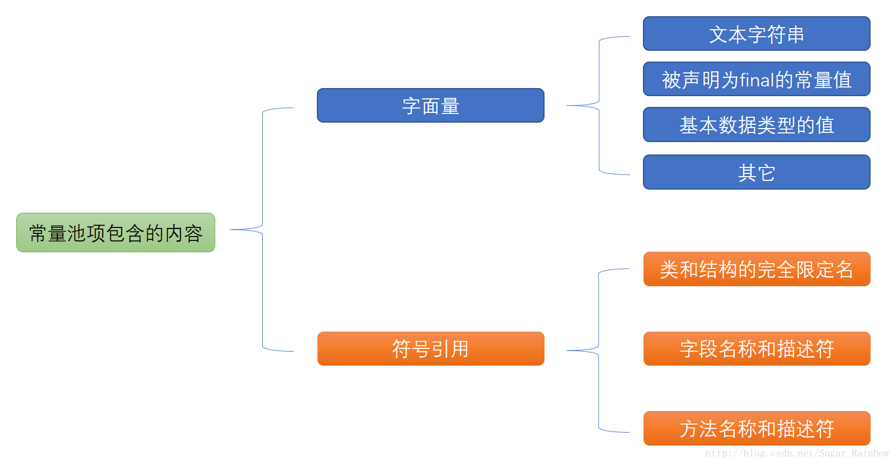
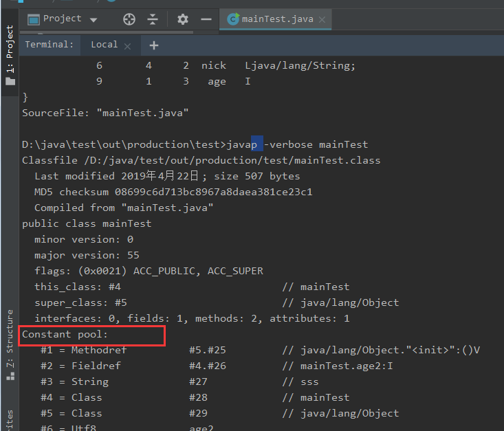
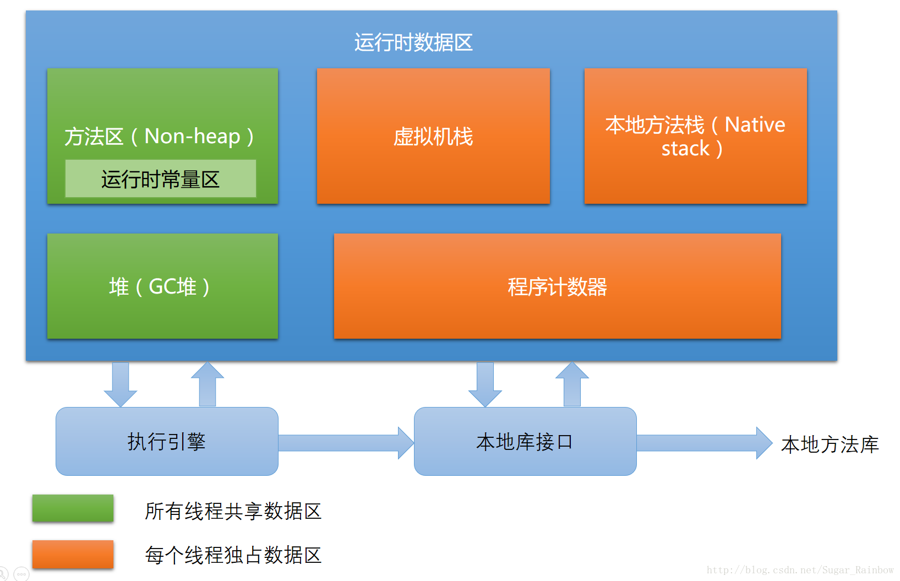

# Java面试中的问题
[TOC]
## 常量池问题
```json
常量池在Java中分两种：
    第一种：静态常量池，class文件内的常量池，是字节码的一部分，用于保存编译时确定的数据。
    第二种：运行时常量池（类似于缓存）
注释：
    如果需要查看字节码可以通过jclasslib bytecode viewer插件。
```
### 静态常量池

Java源码经过编译后，形成class文件（字节码文件）。

class文件包括MagicNumber，Version，Constant_pool【常量池】，Access_flag，This_class，Super_class，Interfaces，Fields，Methods 和Attributes这十个部分。

常量池是class文件中的一项非常重要的数据。 常量池中存放了文字字符串， 常量值， 当前类的类名， 字段名， 方法名， 各个字段和方法的描述符， 对当前类的字段和方法的引用信息， 当前类中对其他类的引用信息等等。 



常量池中几乎包含类中的所有信息的描述， class文件中的很多其他部分都是对常量池中的数据项的引用。



当字节码通过classloader加载到虚拟机后，常量池存储到JVM虚拟机的方法区中。此时静态常量池变成静态常量池。



### 运行时常量池

```java
    
```

HotSpot VM里，记录interned string的一个全局表叫做StringTable，它本质上就是个HashSet<String>。注意它只存储对java.lang.String实例的引用，而不存储String对象的内容。

```java
        String s1 = "Hello";
        String s2 = "Hello";
        String s3 = "Hel" + "lo";
        String s4 = "Hel" + new String("lo");
        String s5 = new String("Hello");
        String s6 = s5.intern();
        String s7 = "H";
        String s8 = "ello";
        String s9 = s7 + s8;

        System.out.println(("s1 == s2 : ") + (s1 == s2));  // true
        System.out.println(("s1 == s3 : ") + (s1 == s3));  // true
        System.out.println(("s1 == s4 : ") + (s1 == s4));  // false
        System.out.println(("s1 == s9 : ") + (s1 == s9));  // false
        System.out.println(("s4 == s5 : ") + (s4 == s5));  // false
        System.out.println(("s1 == s6 : ") + (s1 == s6));  // true
```

## This溢出问题
在构造函数中调用一个可覆盖的（那些既不是private，也不是final的）实例方法同样会导致this引用在构造期间溢出。
- 子类的构造器会默认调用父类的构造器，父类构造器调用可覆盖的方法（子类override）会造成This溢出。
- 匿名内部类会持有一个外部引用，this作为匿名内部类构造方法的第一个参数。
- 在构造器中使用时，ThisEscape并未初始化完成，匿名内部类含有ThisEscape 的外部引用，会造成问题。

```java
public class ThisEscape {
　　public ThisEscape(EventSource source) {
　　　　source.registerListener(new EventListener() {
　　　　　　public void onEvent(Event e) {
　　　　　　　　doSomething(e);
　　　　　　}
　　　　});
　　}
 
　　void doSomething(Event e) {
　　}
 
　　interface EventSource {
　　　　void registerListener(EventListener e);
　　}
 
　　interface EventListener {
　　　　void onEvent(Event e);
　　}
 
　　interface Event {
　　}
}

//改正 通过工厂模式进行

public class SafeListener {
    private final EventListener listener;

    private SafeListener(){
        listener = new EventListener(){
            public void onEvent(Event e){
                doSomething(e);
            }
        }
    }

    public static SafeListener newInstance(EventSource source){
        SafeListener safe = new SafeListener();
        source.registerListener(safe.listener);
        return safe;
    }
}
```