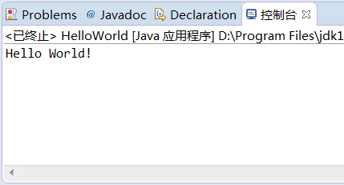

# <font id =  "header">markdown基础语法</a>
[toc]
## 标题部分

语法：

    #       一级标题
    ##      二级标题
    ###     三级标题
    ####    四级标题
    #####   五级标题

样例：


## 列表部分

语法：

    有序序号
        1. 有序序号1
        2. 有序序号2
        3. 有序序号3
        4. 有序序号4
    无序序号
        + 无序列表案例1
        - 无序列表案例2
        * 无序列表案例3
样例：

有序序号
1. 有序序号1
2. 有序序号2
3. 有序序号3

无序序号
+ 无序列表案例1
- 无序列表案例2
* 无序列表案例3

## 字符块
字符块内的md语法有些会失效
+ 代码块

    语法：

        ```java(可以选择填写相应的语言，不指定采用默认)
            相关代码
        ```
    样例：
    ```Java
        public class HelloWorld {
            public static void main(String[] args){
                System.out.println("Hello World!");
            }
        }
    ```

+ 引用(少量字符)

    语法：
    
        `字符`
    样例：

    `字符`

+ 引用

    语法：
    
        tab 相关字符
    样例：
    
        相关字符
+ 引用(带左边框)

    语法：
        
        > 相关字符(>可以嵌套使用)
        >>相关字符
    样例：

    > 相关字符(>可以嵌套使用)
    >>相关字符 
        
## 链接

+ 图片链接
  
    语法：

        
        注：
            
            
    样例：

    
+ 网络链接
  
    语法：

        [链接文字](点击文字跳转的地址，可以是锚点)
        注：
            [跳转到锚点](#header)
            [跳转到百度](www.baidu.com)
    
    样例：

    [跳转到锚点](#header)

    [跳转到百度](www.baidu.com)

## 表格

语法：

    |表头元素1|表头元素2|
    |:---:|:---:|
    |数据|数据|
    注：
        用|表示表格纵向边界，表头和表内容用-隔开，并可用:进行对齐设置，两边都有:则表示居中，若不加:则默认左对齐。

|表头元素1|表头元素2|
|:---:|:---:|
|数据|数据|

## 字体

语法：

    *斜体*
    **加粗**
    ~~删除线~~

样例：

*斜体*

**加粗**

~~删除线~~


## 特殊符号
+ 分隔符
 
    语法：

        ---
    样例：

    ---
+ 方框

    语法：

        - [ ]` 
        - [X]` 
    样例：

    - [ ]
    - [X]
