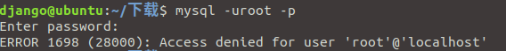

# Mysql使用过程中的问题

[toc]

## 安装

    sudo apt update
    sudo apt install mysql-server
    sudo mysql_secure_installation
    sudo systemctl status mysql.service

## 配置问题(mysql_secure_installation)

    mysql_secure_installation 操作步骤记录说明
    [root@server1 ~]# mysql_secure_installation
    NOTE: RUNNING ALL PARTS OF THIS SCRIPT IS RECOMMENDED FOR ALL MySQL
    SERVERS IN PRODUCTION USE! PLEASE READ EACH STEP CAREFULLY!
    In order to log into MySQL to secure it, we’ll need the current password for the root user. If you’ve just installed MySQL, and you haven’t set the root password yet, the password will be blank, so you should just press enter here.
    Enter current password for root (enter for none):<–初次运行直接回车

    OK, successfully used password, moving on…
    Setting the root password ensures that nobody can log into the MySQL root user without the proper authorisation.
    Set root password? [Y/n] <– 是否设置root用户密码，输入y并回车或直接回车

    New password: <– 设置root用户的密码

    Re-enter new password: <– 再输入一次你设置的密码

    Password updated successfully!
    Reloading privilege tables…
    … Success!
    By default, a MySQL installation has an anonymous user, allowing anyone
    to log into MySQL without having to have a user account created for
    them. This is intended only for testing, and to make the installation
    go a bit smoother. You should remove them before moving into a
    production environment.
    Remove anonymous users? [Y/n] <– 是否删除匿名用户,生产环境建议删除，所以直接回车

    … Success!
    Normally, root should only be allowed to connect from ‘localhost’. This ensures that someone cannot guess at the root password from the network.
    Disallow root login remotely? [Y/n] <–是否禁止root远程登录,根据自己的需求选择Y/n并回车,建议禁止(根据个人需求)

    … Success!
    By default, MySQL comes with a database named ‘test’ that anyone can
    access. This is also intended only for testing, and should be removed
    before moving into a production environment.
    Remove test database and access to it? [Y/n] <– 是否删除test数据库,直接回车(根据个人需求)

    Dropping test database…
    … Success!
    Removing privileges on test database…
    … Success!
    Reloading the privilege tables will ensure that all changes made so far
    will take effect immediately.
    Reload privilege tables now? [Y/n] <– 是否重新加载权限表，直接回车

    … Success!
    Cleaning up…
    All done! If you’ve completed all of the above steps, your MySQL
    installation should now be secure.
    Thanks for using MySQL!
## 常见安装问题
### root无法远程登录

问题：

    root用户被禁止远程登录

解决方法：

    修改mysqld.cnf文件，注释"bind-address = 127.0.0.1"
    修改mysql数据库user表，root用户的host字段，改“localhost”，为“%”
    注：
        mysqld.cnf的完整文件路径为：/etc/mysql/mysql.conf.d/mysqld.cnf

### mysql出现ERROR1698(28000)

问题：

解决方法：

    1. 修改mysqld.cnf取消登录验证
        [/etc/mysql/mysql.conf.d/mysqld.cnf]
        user            　 = mysql
        pid-file        　 = /var/run/mysqld/mysqld.pid
        socket        　　 = /var/run/mysqld/mysqld.sock
        port            　 = 3306
        basedir        　　= /usr
        datadir       　　 = /var/lib/mysql
        tmpdir       　　　= /tmp
        lc-messages-dir   = /usr/share/mysql
        skip-external-locking
        character-set-server=utf8
        collation-server=utf8_general_ci
        skip-grant-tables　　　　<-- add here
    2. 重启服务
        sudo systemctl restart mysql.service
    3. 进入mysql的user表中修改user的authentication_string(该字段为密码)和plugin
        use mysql;
        update user set authentication_string=password("你的密码"),  plugin = "mysql_native_password" where user="root";
        flush privileges;
    4. 修改mysql.cnf文件，删除步骤1增加的语句
    5. 重新启动

