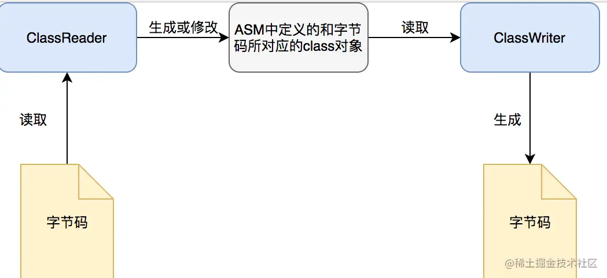

# 字节码增强

## 字节码
[参考链接](https://tech.meituan.com/2019/09/05/java-bytecode-enhancement.html)
## ASM

### ASM介绍
[参考链接](https://juejin.cn/post/6844903641841680397?spm=a2c6h.12873639.article-detail.6.32706ab23Stgmi)
ASM是一个java字节码操纵框架，它能被用来动态生成类或者增强既有类的功能。ASM 可以直接产生二进制 class 文件，也可以在类被加载入 Java 虚拟机之前动态改变类行为。Java class 被存储在严格格式定义的 .class文件里，这些类文件拥有足够的元数据来解析类中的所有元素：类名称、方法、属性以及 Java 字节码（指令）。ASM从类文件中读入信息后，能够改变类行为，分析类信息，甚至能够根据用户要求生成新类。
ASM的优点如下:

1. 动态生成类或者增强既有类的功能
2. 字节码转换成java语言，从而你就可以随心所欲的操纵字节码。
3. 可以直接产生二进制 class 文件，也可以在类被加载入 Java 虚拟机之前动态改变类行为
4. ASM从类文件中读入信息后，能够改变类行为，分析类信息，甚至能够根据用户要求生成新类。


### ASM库

ASM 库提供了两个用于生成和转换已编译类的API。

1. 一个是核心API，以基于事件的形式来表示类。
```txt
核心api，可以对比XML中解析的SAX，不需要把这个类的整个结构读取进来，节约内存，但是编程难度较大。在采用基于事件的模型时，类是用一系列事件来表示的，每个事件表示类的一个元素，比如它的一个字段、一个方法声明、一条指令，等等。基于事件的API定义了一组可能事件，以及这些事件必须遵循的发生顺序，还􁨀供了一个类分析器，为每个被分析元素生成一个事件，还􁨀供一个类写入器，由这些事件的序列生成经过编译的类。
```
2. 另一个是树API，以基于对象的形式来表示类。

```txt
树API，对比XML解析中的DOM，需要把整个类的结构读取到内存中，消耗内存多，但是变成较为简单
```
## ASM实例
[参考链接](https://blog.csdn.net/m0_37583655/article/details/122680988)


## 字节码增强实例