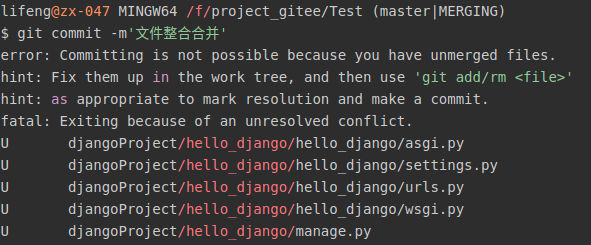

# Git使用过程中出现的问题

## [首页](./../../README.md)
[toc]

## git pull origin master，远程仓库和本地仓库版本不一致
问题：

    fatal：refusing to merge unrelated histories

解决方法：

    git pull origin master --allow-unrelated-history
## git 上无法显示中文
问题：


解决方法：

    git config --global core.quotepath false

## git 限制大文件上傳

問題：
    超過100M的文件無法上傳

解決方法：

    //如果之前已經把大文件commit，但是push失敗。需要從cache刪除，重新commit。
    1. git rm --cached “file_name”
    2. git commit --amend
    3. 下載git lfs，然後安裝deb包
    4. git lfs install 安裝lfs
    5. git lfs 安裝lfs
    6. git lfs track “*.pdf” track對應的文件
    7. git lfs ls-files ls所有track的文件
    8. git push

## git local 和 remote 不一致

问题：

```shell
To github.com:Jefferson1743/Daydreaming.git
 ! [rejected]        master -> master (fetch first)
error: failed to push some refs to 'git@github.com:Jefferson1743/Daydreaming.git'
hint: Updates were rejected because the remote contains work that you do
hint: not have locally. This is usually caused by another repository pushing
hint: to the same ref. You may want to first integrate the remote changes
hint: (e.g., 'git pull ...') before pushing again.
hint: See the 'Note about fast-forwards' in 'git push --help' for details.
```

解决方法：
    git pull --rebase origin master
