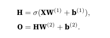

# 动手学深度学习

[toc]

## 前言

### 基础了解

深度学习与一门学科结合：

+ 以特定的方式提出问题的动机
+ 给定建模方法的数学
+ 将模型拟合数据的优化算法
+ 有效训练模型、克服数值计算并最大限度地利用现有硬件的工程方法

个人需要的能力：

+ 批判性思维技能
+ 解决问题所需要的数学知识
+ 解决方案所需的软件工具

### 生活中的机器学习

#### 基本词汇

+ 参数：通过调整参数，来调节程序的行为。
+ 模型族：通过调整参数而生成不同程序的集合(程序：输入输出的映射)。
+ 学习算法：使用数据集选择参数的元程序。
+ 训练流程：


```txt
在使用及其学习解决问题之前，必须精确定义问题，确定输入输出的性质，选择合适的模型族。
1. 确定一个模型结构，并初始化参数
2. 获取数据样本
3. 调整参数
4. 重复获取2、3两个步骤
```


#### 关键组件

机器学习的关键组件包括四个部分：

+ 我们可以学习的数据
+ 如何转换数据的模型
+ 一个目标函数，用来量化模型的有效性
+ 调整模型参数以优化目标函数的算法

1. 数据：

```txt
每个数据集由样本构成，每个样本由特征构成。每个样本遵循iid的条件。

每个样本的特征数量都一致，有相同的长度，长度被成为数据的维度。

数据量越大，越有助于训练更强大的模型，从而减少对余弦设想的依赖。

Garbage in, garbage out。错误的数据会造成效果差。比如：数据分布不均匀（某种情况数据量少）；数据本身有偏见（数据本身就存在偏见，低质量）。
数据分为训练集和测试集。

数据集被分为三个部分：
    1. 训练集(用于拟合模型参数)
    2. 验证集(用于评估拟合效果)
    3. 测试集(通常测试集是不可以见的，验证集用于代替测试集)
```

2. 模型


```txt
机器学习从数据中学习，学习是指自主提高模型完成某些任务的效能。
深度学习注重强大的模型，将神经网络进行堆叠交织。
```

3. 目标函数

```txt

目标函数定义为模型的优劣程度，根据模型的参数（受决定于数据集）的具体情况，定义一个可以优化的目标函数，寻找到最佳的模型。


目标函数：
    预测数值： 平方误差。
    分类问题： 错误率
```

4. 优化算法

```txt
剃度下降方法：梯度的方向是函数在给定点上升最快的方向，那么梯度的反方向就是函数在给定点下降最快的方向
```
### 分类

#### 监督学习


+ 回归
+ 分类
+ 标记
+ 搜索
+ 推荐系统
+ 序列学习

#### 无监督学习

+ 聚类
+ 主成分分析
+ 因果关系和概率图模型问题
+ 生成对抗性网络

与环境互动

```txt
主要应对以下几种问题：
    1. 环境对模型是否重要
    2. 环境是否有助于建模（语音识别）
    3. 环境是否想打败模型（垃圾邮件过滤）
    4. 环境是否变化（distribution shift）
```


强化学习


```txt
强化学习的过程是：agent持续接受environment的一些observation。

    agent接收到environment的observation
    agent接收，并选择一个action
    action通过某种机制传输到environment
    agent从environment获得reward
    循环第一步

目标是产生一个好的策略
```


### 近年的进展

dropout
attention机制
多阶段设计
生成对抗网络
并行计算能力提升
可伸缩算法
深度学习框架

## 基础操作

### 基础运算符

按照元素进行计算(+ - * ** / == )

### 基本运算

```txt

    torch.cat
    torch.dot
    torch.mv
    torch.mm
    torch.exp
    torch.cumsum
    X.sum(dim) //sum默认会降维，可以通过keepdims属性设置
    X.mean()
    X.numel()


    广播机制：维度不同的张量会扩展成相同类型，再进行基本操作。
    
    切片：
        X[1:4:2, 1:-1:4]
    
    节省内存:

        切片法，避免重新开辟空间(Memo[:] = <expression>)
        避免轻易对变量转换类型，可以通过调用变量本身的方法

```

### 数据预处理

```txt
    1. 读取数据集 //pd.read_csv
    2. NAN值处理 //data.fillna()
    3. onehot编码 //data.getdummies()
    4. 转换成张量 //torch.tensor(data.values)
```

### 微分

目标函数反映模型的效果。拟合的主要体现在两个方面：优化和泛化。都需要通过微分来寻找

+ 自动求导(反向传播、Y.sum().backward()、Y.detach())
+ 反向传播

```txt
神经网络沿着输出层到输入层的顺序计算梯度的方法，依据的是链式法则

```

+ 正向传播

```txt
神经网络沿着输入层到输出层的顺序，依次进行计算并存储模型的中间变量。比如：输入层、隐藏层、输出层、loss。
```


### 经验分布

经验分布：依据抽样数据的分布概率Fn(X)，对原数据分布F(X)进行估计。

```txt
将抽样的数据按照升序进行排列，然后估计 xi < X 的概率，

Fn(X) = 0 (X < X1)
      = k/n (Xk <= X <= Xk+1)
      = 1 (X > Xk)
    

Fn(X)的示性函数：I(X) = k/n (Xk<= X <= Xk+1)
                    = 0 (其他情况)

E(Fn(X)) = F(X)
Var(Fn(X)) = (1/n)(1-F(X))(F(X))
```

依据大数定理，经验分布趋同于真实分布如下图所示


### 熵
+ 熵：H(X)
+ 交叉熵：H(P,Q) = P(X)logQ(X)
+ 条件熵：H(Y|X) = H(X,Y) - H(X)
+ 相对熵: DKL = P(X)log(P(X)/Q(X)) (P相对Q的相对熵)

```txt
训练集的数据分布Ptrain(X)，学习后的模型分布概率为Pmodel(X)，衡量模型的有效性可以通过相对来实现。
Ptrain(X)相对与Pmodel(X)的相对熵，即：KL散度
Dkl(Ptrain, Pmodel) = Ptrain(X)log(Ptrain(X)/Pmodel(X)) = Ptrain(X)logPtrain(X) - Ptrain(X)log(Pmodel(X)) = H(Xtrain) - H(Xtrain, Xmodel)
显而易见 训练集的熵是一个常数，直接通过交叉熵评价模型的优劣。
```

+ 信息增益：G = H(X) - H(X|A)

### MLE
MLE的核心思想：找到一组参数θ，是的现有的Y以最大的概率出现。
Y = P(X|θ)，在已知一部分X、Y数据的基础上，求取。


采用的MLE，需要Y|X关于θ的函数达到最大值，此刻θ即所求。

+ MLE: argmin[-sigma(logp(Xi))]
+ 基于经验分布的MLE: argmin[-sigma(p(Xi)logp(Xi))]

## 线性回归

### 训练线性回归

循环在训练集训练epoch次。
每个epoch的训练如下：

```txt
每次迭代过程中，通过迭代器读取一个batch的数据，输入模型，通过正向传播计算每个batch上的loss，然后通过反向传播计算参数的梯度，通过剃度下降算法更新模型的参数。

其中超参数包括：epoch、batch、learning rate、decay(衰减系数)。

在读取数据集的过程中，通过迭代器进行读取，可以降低内存的压力，需要训练的时候才读取到内存进行训练。


tips

with no_grad():
    在代码块中，不追踪梯度
torch.tensor(vector, require_grad = True)
    参数增加梯度。

param.grad.zero_()
    更新梯度后，要将梯度重置
nn.MSELoss()
    nn.MSELoss(reduction='none') //返回向量
    nn.MSELoss(reduction='mean') //返回标量，MSELoss的默认选择
    nn.MSELoss(reduction='sum') //返回标量
```

### 手动实现线性

tips

```txt
1. 计算过程中Y的shape
2. iter读取小批量数据
3. 写完代码需要检查
```

### 分类问题

#### onehot编码

onehot编码，可以对应用于softmax。

```txt
分类任务中存在【猫、狗、兔】三个类别。每个类别对应的onehot编码为：
    猫：[0, 0, 1]
    狗：[0, 1, 0]
    兔：[1, 0, 0]
可以应用于分类任务中，损失函数的计算（交叉熵）
```
#### softmax运算

+ softmax的定义

```txt
Yhat = softmax(o) yj = exp(yj) / sigma(yi) //在计算loss时候使用
Y = argmax(yj) = argmax(o)
softmax 虽然是一个非线性函数，但是它仍然是由一个仿射变换，因此仍然是一个线性模型。
```

+ softmax的导数

```txt
loss(y, yhat) = yj / (exp(oj)/sigma(exp(o)))  //只有yj是1，其他概率为0
loss关于o的导数(即：输出层的导数)为：softmax(o)j - yj //即真实值与预测值之间的差值
```

+ 对数似然


根据上式子可以理解交叉熵：

```txt
1. 求似然函数的最大值
2. KL散度最小
```

## MLP(多层感知机)

传统的回归模型，是通过仿射变换实现，其中仿射变换有一个很强的假设：线性。线性的假设即造成某些特征的增加或者减少一定会造成结果的线性变化。但是对于某些问题难以解决，比如图像问题、金融风控问题等等。

在传统的线性模型中，增加一些隐藏层来增加模型的表达能力


### 隐藏层

但是只是增加一些线性变换，仍然会导致一些问题：仿射函数的仿射函数仍然是仿射函数，与不添加隐藏层的表达效果仍然一致。


为了解决上述问题，通过在隐藏单元添加非线性的激活函数，来避免多层的模型退化成仿射函数。



### 激活函数

+ relu(一般不会出现小于0的状况，比较简单，比较适合使用)
+ sigmoid(sigmoid的导数：sigmoid(1-simoid))
+ tanh

### 模型选择、欠拟合、过拟合

模型需要完成的目标是发现模型 ，但是在训练过程中难以确认模型是真正发现了一种模式还是简单地集注了数据。

将模型在训练数据熵拟合的比潜在分布中更接近的现象叫做过拟合，用于对抗过拟合的技术叫做正则化。

1. 训练误差和泛化误差


```txt
训练误差: 在训练集上的误差

泛化误差(eponymous theorem): 当模型应用于从原始数据中抽取的数据集时，表现的误差。

目前的监督学习都是有一个共同的基石，训练集和测试集是来自于同一个分布。
```

2. 模型的复杂性

复杂的模型：

```txt
1. 有更多参数的模型被认为是复杂的
2. 参数具有更大选择范围的模型被认为是复杂的
3. 需要更多训练迭代的模型比较复杂，需要提前停止的模型不那么复杂
4. 能够轻松解释任何事实的模型是复杂的，表达能力有限但是能够很好地解释数据的模型具有更大的显示用途。
```

模型的复杂性对泛化有比较大的影响

```txt
1. 可以调整参数的数量大，容易过拟合
2. 参数可以变化的范围大，容易过拟合
3. 训练的数据量过少，容易过拟合
```

3. 模型选择(只有这种情况才能使用验证集)
模型选择经常有几种情况：

+ 模型的本质类型不一致

+ 模型的本质类型一致，需要选择具体的最优超参数

```txt
比如在确定MLP的超参数：
    epoch
    batch_size
    激活函数
    衰减系数
    隐藏单元的个数等等
```

在选择对应最佳的模型，需要使用验证集来确定。

```txt
常见的做法：将数据分为三份，训练集、验证集、测试集。
实质上并不存在真正的测试数据集，测试集的准确度只是验证集的准确度。

```

选择最优模型的方法：K折交叉验证

4. 欠拟合、过拟合

如何辨别两种情况：

```txt
欠拟合：当训练误差和验证集上的误差都很大，说明模型过于简单化，无法捕捉学习的模式，可以使用一个更加复杂的模型来降低训练误差。
过拟合：在训练集的表现过于优秀，但是在验证集上的表现不佳。
```


### 权重衰减(正则化)

缓解过拟合的方式有增加数据量，但是也增加了工作量和机器性能需求。更多通过正则化来实现。

L2正则化，通过添加对w的惩罚，来压缩参数的表达空间，继而避免模型的过拟合。

L2更倾向于压缩大权重的表达空间，让权重分布更加均匀。

但是L1则更加倾向于将其他的权重清零，而将权重集中到一小部分的特征上来。


L2正则的梯度更新方法


上式中的 lamda 可以实现对W的控制，亦即衰减系数。

衰减系数提供了一套连续的机制调整函数的复杂度。

### dropout

偏差-方差

```txt
线性回归和神经网络分属于偏差-方差的两个极端。
· 线性回归实则是仿射变换，表达上实则是线性变换，忽略了特征与特征之间的关系，在表达上具有很大的局限性，只能表示小部分的数据，但是在这个数据上的表现方差很小。
· 神经网络能够实现特征之间的叠加，增加对数据的表达能力，但是在数据上的表现方差可能很大。

```

dropout的由来

```txt
在输入中添加噪声等价于Tikhonov正则化，后续这一想法被应用于神经网络的隐藏层。在训练的过程中增加噪声，只会增加输入-输出映射上的平滑性。
```


在测试的过程中，不会使用dropout。在预测的时候需要保证在不同的样本上模型都是一致的。

在神经网络中，会存在一种对称性，亦即每一层的神经网络之间会具有排列对称性。引入dropout后不存在这种问题。

### 数值稳定性和模型初始化

#### 模型的初始化

```txt
参数的初始化对模型有非常大的影响，如果初始化的参数非常糟糕，会出现梯度消失、梯度爆炸
参数的初始化对神经网络保持数值的稳定性保有至关重要的作用。
输出层关于w的偏导数，若干个相乘很容易导致数值的爆炸。
```


#### 数值初始化

+ 默认初始化(高斯分布初始化权重)
+ Xavier初始化

