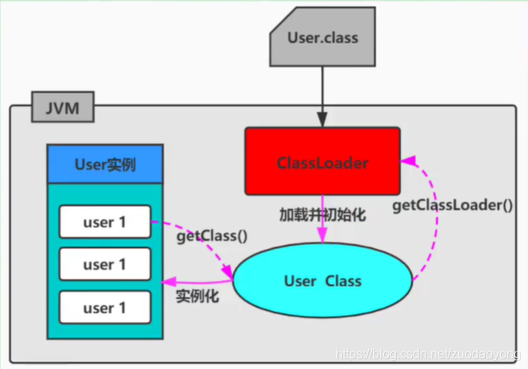

# sandbox使用

## Spring的AOP机制
## JVMTI机制
## 类加载
ClassLoader是Java的核心组件，所有的Class都是由ClassLoader进行加载的，ClassLoader负责通过各种方式将Class信息的二进制数据流读入JVM内部，转换为一个与目标类对象的java.lang.Class对象实例，然后交给JVM进行链接、初始化等操作。因此，ClassLoader在整个装载阶段，只能影响到类的加载，而无法通过ClassLoader去改变类的链接和初始化行为。至于它是否可以运行，则由执行引擎决定。

### ClassLoader分类


1. 引导类加载器（Bootstrap ClassLoader）： 该类由C/C++语言实现，嵌套在JVM内部；用来加载Java核心库（JAVA_HOME/jre/lib/rt.jar或sun.boot.class.path路径下的内容）；出于安全考虑，只加载包名为java、　　　　javax、sun等开头的类 
2. 扩展类加载器（Extension ClassLoader） java语言，sun.misc.Launcher.$ExtClassLoader实现，继承于ClassLoader类，父类加载器为启动类加载器；从JAVA_HOME/jre/lib/ext子目录下加载类库 
3. 系统类加载器（AppClassLoader） java语言，sun.misc.Launcher.$AppClassLoader实现，继承于ClassLoader类，父类记载器为扩展类加载器；它是用户自定义类加载器的默认父加载器

4. 自定义类加载器：

　　（1）在Java日常应用程序开发中，类的加载几乎是由上述3类加载器相互配合执行的。在必要时，我们还可以自定义类加载器，来定制类的加载方式

　　（2）体现Java语言强大生命力和巨大魅力的关键因素之一便是Java开发者可以自定义类加载器来实现类库的动态加载，加载源可以是本地Jar包，也可以是网络上的远程资源。

　　（3）通过类加载器可以实现非常巧妙的插件机制，这方面的实际应用案例举不胜举。例如Eclipse的插件机制。类加载器为应用程序提供了一种动态增加新功能的机制，这种机制无须重新打包发布应用程序就能实现

　　（4）自定义类加载器能够实现应用隔离，例如tomcat、spring等中间件和组件框架都在内部定义了自定义的类加载器，并通过自定义的类加载器隔离不同的组件模块。这种机制比C/C++程序要好太多，想不修改C/C++程序就能为其新增功能，几乎是不可能的，仅仅一个兼容性便能阻挡住所有美好的设想。

　　（5）自定义类加载器通常需要继承于ClassLoader
### 类加载方式
类的加载方式：虚拟机将编译后的字节码文件加载到内存的方式。

1. 显式加载
Java代码通过调用ClassLoader加载class对象。
```java
Class.forName(String name);
this.getClass().getClassLoader().loadClass()
```
2. 隐式加载

Java中没有明确的调用加载代码，通过JVM自动加载到内存。
```java
加载某个类时，该类引用了另一个类的对象。
User u = new User();
```
###命名空间
1. 每个类加载器都有自己的命名空间，命名空间由该加载器及所有的父加载器所加载的类组成

2. 在同一命名空间中，不会出现类的完整名字（包括类的包名）相同的两个类

3. 不同的命名空间中，有可能会出现类的完整名字（包括类的包名）相同的两个类

```txt
在大型应用中，我们往往借助这一特性，来运行同一个类的不同版本。　　

对应任意一个类，都需要由加载它的类加载器和这个类本身一同确认其在Java虚拟机中的唯一性。

每一个类加载都拥有一个独立的类名称空间：比较两个类是否相等，只有在这两个类是同一个类加载的前提下才有意义！否则，即使这两个类源自同一个Class文件，被同一个虚拟机加载，只要加载他们的类加载器不同，那么这两个类就必定不相等。
```
### 双亲委派机制

双亲委派模型。但不是所有类加载都遵守这个模型，有的时候，启动类加载器所加载的类型，是可能要加载用代码的。例如JDK内部的SPI机制，用户可以在标准API框架上，提供自己的实现，JDK也需要提供默认的参考实现。比如JDBC、JNDI等很多方面都是利用这种机制，这种情况就不会使用双亲委派模型去加载，而是利用所谓的上下文加载器。

定义：如果一个类加载器在接到加载类的请求时，它首先不会自己尝试去加载这个类，而是把这个请求任务委托给父类加载器去完成，依次递归，如果父类加载器可以完成类加载任务，就成功返回，只有父类加载器无法完成此加载任务时，才自己去加载。（“典型啃老族”）

本质：规定了类的加载顺序：引导类加载器先加载，若加载不到，由扩展类加载器加载，若还加载不到，才会由系统类加载器或者自定义的类加载器进行加载。

优势：避免了类的重复加载，确保一个类的全局唯一性；保护程序安全，防止核心API被随意篡改

结论：由于Java虚拟机规范并没有明确要求类加载器的加载机制一定要使用双亲委派模型，只是建议采用这种方式而已。比如在tomcat中，类加载器所采用的加载机制就和传统的双亲委派模型有一定区别，当缺省的类加载器接收到一个类的加载任务时，首先会由它自行加载，当它加载失败时，才会将类的加载任务委派给它的超类加载器去执行，这同时也是Servlet规范推荐的一种做法。


### java -Xbootclasspath

### SPI